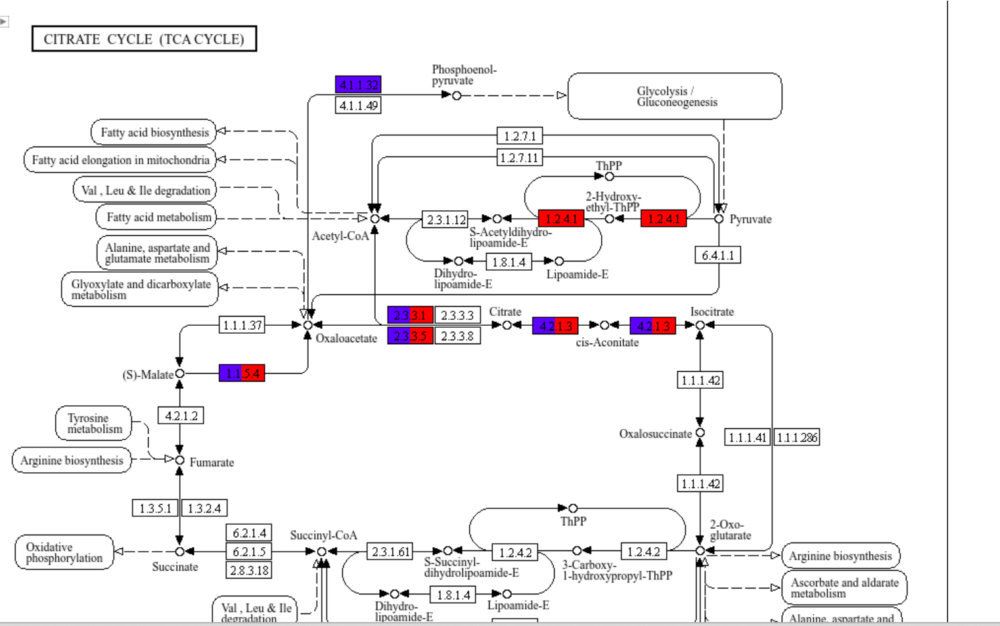
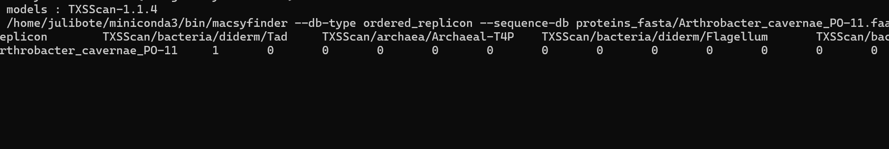

# Taxonomy
## Is your genome a new genus, new species, new strain or new isolate?
check the genome name from gtdbtk in (https://lpsn.dsmz.de/). This website is part of the German Culture Collection and contains the most up-to-date species names available to date
Download the assembled genome of the type strain from NCBI.
Download a second genome from the same species from NCBI, also corresponding to the type strain.
Download a third genome belonging to the same family but representing a different species.
## Calculate Digital DNA-DNA hybridization
submit these genomes to (https://ggdc.dsmz.de/ggdc.php) to calculate digital DNA-DNA hybridization

If the dDDH value between two genomes is ≥70%, the two genomes are generally considered to belong to the same species

## Calculate Average nucleotide identity
go to (https://www.ezbiocloud.net/tools/ani) to calculate ANI
note ANI values
If the ANI value between two genomes is above 95-96%, the two genomes are generally considered to belong to the same species
If the ANI value between two genomes is above 99.99%, the two genomes are generally considered to belong to the same strain
# KEGG analysis

```bash
mkdir -p kegg_ids
grep -o "KEGG:K....." genomes/Arthrobacter_cavernae_PO-11.gff3 | tr ":" "\t" > kegg_ids/Arthrobacter_cavernae_PO-11.gff3_kegg_ids.txt 
grep -o "KEGG:K....." genomes/M9409_L16.gff3 | tr ":" "\t" > kegg_ids/M9409_L16.gff3.gff3_kegg_ids.txt
```

## Compare multiple genomes with Kegg mapper colors 
(https://www.genome.jp/kegg/mapper/color.html)
```bash
awk '{print $2 "\tblue"}' kegg_ids/Arthrobacter_cavernae_PO-11.gff3_kegg_ids.txt> kegg_ids/Arthrobacter_cavernae_PO-11.gff3_kegg_ids_color.txt
awk '{print $2 "\tred"}' kegg_ids/M9409_L16.gff3.gff3_kegg_ids.txt>kegg_ids/M9409_L16.gff3.gff3_kegg_ids_color.txt

cat kegg_ids/Arthrobacter_cavernae_PO-11.gff3_kegg_ids_color.txt kegg_ids/M9409_L16.gff3.gff3_kegg_ids_color.txt> kegg_ids/kegg_mapper_color.txt
```
submit file  `kegg_mapper_color.txt` to (https://www.genome.jp/kegg/mapper/color.html)


 what are the main difference between your genome and your reference genome
 main metabolism or secondary metabolism?

# Macsyfinder
(https://github.com/gem-pasteur/macsyfinder)
Identify bacterial secretion systems

```bash
conda install -c bioconda macsyfinder
download the database size (36M)
macsydata install --target /home/julibote/TXSScan_model TXSScan -f
```

```bash
mkdir -p macsyfinder
ls proteins_fasta/*.faa > files_list.txt
while IFS= read -r fasta; do
    sample=$(basename "$fasta" .faa)
    macsyfinder --db-type ordered_replicon \
  --sequence-db "$fasta" \
  --models-dir /home/julibote/TXSScan_model \
  --models TXSScan all \
  -o macsyfinder/"$sample"
done < files_list.txt
```
check file `macsyfinder/Arthrobacter_cavernae_PO-11/best_solution_summary.tsv` 


# Ecological inference
 Can your isolate be found in other environments? 
 Which environments?
(https://branchwater.sourmash.bio/)


# Roary
```bash
conda install -c bioconda roary
wget https://raw.githubusercontent.com/sanger-pathogens/Roary/master/contrib/roary_plots/roary_plots.py
conda install -c conda-forge biopython pandas matplotlib seaborn
```
```bash
roary -f roary_output -e -n genomes/*.gff3
FastTree -nt -gtr roary_output/core_gene_alignment.aln > roary_output/my_tree.newick
python roary_plots.py roary_output/my_tree.newick roary_output/gene_presence_absence.csv
```


